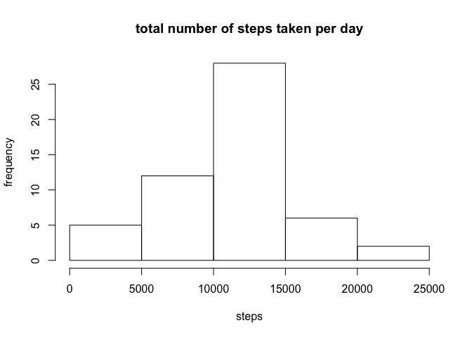
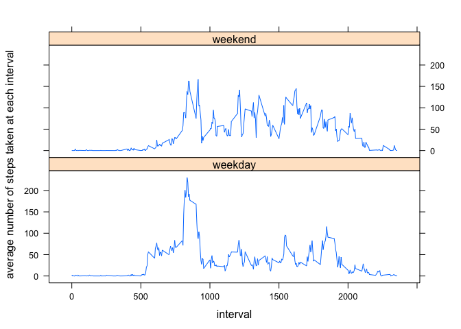

# Reproducible Research: Peer Assessment 1
This assignment analyed data obtained from a personal acitivity monitoring device. The data was clollected every 5 mintues through out the whole day during the months of October and November in 2012.The dataset contains three variables: the number of steps taken in each 5 minitues intervals each day, date, and time.This report summaried: 1) the mean total number of steps taken perday; 2) the average daily activity pattern; 3) the mean total number of steps taken perday after the missing data of steps were imputed; 4) the difference in activity patterns between weekend and weekday.

## Loading and preprocessing the data


```r
## make sure the activity.zip is already unzipped
activity<-read.csv("activity.csv")
## summary of the data
str(activity)
```

```
## 'data.frame':	17568 obs. of  3 variables:
##  $ steps   : int  NA NA NA NA NA NA NA NA NA NA ...
##  $ date    : Factor w/ 61 levels "2012-10-01","2012-10-02",..: 1 1 1 1 1 1 1 1 1 1 ...
##  $ interval: int  0 5 10 15 20 25 30 35 40 45 ...
```

```r
library(lattice)
## convert the date column as date format
activity$date<-as.Date(activity$date,"%Y-%m-%d")
```

## What is mean total number of steps taken per day?

In this part, the dataset was split based on the date, and the sum, mean, and median of the total number of steps taken per day were calcualted.


```r
s<-split(activity,activity$date)
t_step<-sapply(s,function(x) sum(x[,"steps"]))
hist(t_step,xlab="steps",ylab="frequency",main="total number of steps taken per day")
```

 

```r
## mean of the total number of steps taken per day
mean(t_step,na.rm=TRUE)
```

```
## [1] 10766.19
```

```r
## median of the total number of steps taken per day
median(t_step,na.rm=TRUE)
```

```
## [1] 10765
```

The histogram shows the frequency distribution of the total number of steps taken per day. the mean of the total number of steps taken per day is 1076.19, and the median of the total number of steps taken per day is 10765.

## What is the average daily activity pattern?

In this part, the dataset was split based on the interval, and the mean of the steps taken at each interval was calcuated through all the days.


```r
## split the dateset based on interval
s2<-split(activity,activity$interval)
t_step2<-sapply(s2,function(x) mean(x[,"steps"],na.rm=TRUE))
plot(unique(activity$interval),t_step2,type="l",xlab="interval",ylab="average steps taken at that interval",main="average steps taken at each interval through all the days")
```

 

```r
##max number of steps
max_interval <- which.max(t_step2)
max_interval
```

```
## 835 
## 104
```

The plot shows the average number of steps taken at each interval through all the days. Note that the maximum average number of steps occurs at 8:35 am.

## Imputing missing values
In this part, the missing values in the steps column were imputed using the average number of steps occurs at each interval


```r
#calculate and report the total number of missing values in the dataset
sum(is.na(activity$steps))
```

```
## [1] 2304
```

```r
#use the mean for that 5-minute interval to fill in the missing values
average_step<-data.frame(unique(activity$interval),t_step2)
names(average_step)<-c("interval","step_avg")
temp_steps=NULL
for (i in 1:nrow(activity)) {
    if (is.na(activity[i,]$steps)) {
        temp_steps[i]<-average_step[average_step$interval==activity[i,]$interval,]$step_avg        
    }
    else {
        temp_steps[i]<-activity[i,]$steps   
    }    
}
## create a new dataset
new_activity<-data.frame(temp_steps,activity$date,activity$interval)
names(new_activity)<-c("steps","date","interval")
##
s3<-split(new_activity,new_activity$date)
t_step3<-sapply(s3,function(x) sum(x[,"steps"]))
hist(t_step3,xlab="steps",main="total number of steps taken per day")
```

 

```r
mean(t_step3,na.rm=TRUE)
```

```
## [1] 10766.19
```

```r
median(t_step3,na.rm=TRUE)
```

```
## [1] 10766.19
```

The total number of missing steps is 2304. After filling the missing values for steps using the average steps at that interval.Aboving plot shows the total number of steps taken per day after the missing values are filled. Note that the total number of steps taken per day has increased. The average of the total number of steps taken per day does not change, but the median of the total number of steps taken per day changes because the number of null NA points increases. 

## Are there differences in activity patterns between weekdays and weekends?
This part analyzed the differences in activity patterns between weekdays and weekends. The dataset is split based on both interval and weekday ("weekend","weekday").


```r
## add a new column to the dataset indicating weekday or weekend
new_activity$weekday<-weekdays(new_activity$date)
new_activity[new_activity$weekday %in% c("Saturday","Sunday"),]$weekday<-"weekend"
new_activity[new_activity$weekday %in% c("Monday","Tuesday","Wednesday","Thursday","Friday"),]$weekday<-"weekday"
new_activity$weekday<-as.factor(new_activity$weekday)
##calculate the mean of number of steps taken at each interval through all the days
s4<-aggregate(steps~interval+weekday,data=new_activity,mean)
xyplot(steps~interval|weekday,s4,type="l",layout=c(1,2),xlab="interval",ylab="average number of steps taken at each interval")
```

 

The aboving plot shows the activity patterns between weekdays and weekends. Note that for weekdays, a peak of number of steps occurs at around 8:00 am, while for weekends, the peak is not that obivisous.
